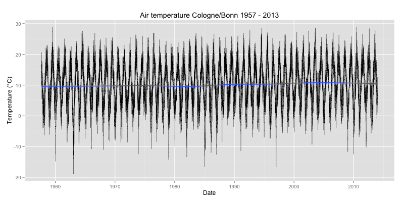

Daily Weather data from Cologne/Bonn airport / Tägliche Wetterdaten vom Flughafen Köln/Bonn
===========================================================================================

## Description

Historic weather records from Cologne/Bonn airport (EDDK), acquired from [DWD](http://www.dwd.de/).

The records have a daily interval, starting in September 1957.

CSV files in this folder contain the following columns:

* Mess_Datum: Date in the format "YYYYMMDD"
* Qualitaets_Niveau: An integer (1, 3, 5, 7, 10) indicating the data quality level
* BEDECKUNGSGRAD: Cloud coverage mean as a float between 0.0 and 8.0.
* REL_FEUCHTE: Mean of relative humidity as percentage float.
* DAMPFDRUCK: Steam pressure in hpa, float between 1.3 and ~23.2
* LUFTTEMPERATUR: Air temperature daily mean in degrees Celsius, float
* LUFTDRUCK_STATIONSHOEHE: Air pressure daily mean in hpa, float
* WINDGESCHWINDIGKEIT: Wind speed daily mean, probably in meters/second
* LUFTTEMP_AM_ERDB_MINIMUM: Ground temperature daily minimum
* LUFTTEMPERATUR_MINIMUM: Air temperature daily minimum
* LUFTTEMPERATUR_MAXIMUM: Air temperature daily maximum
* WINDSPITZE_MAXIMUM: Wind speed daily maximum
* NIEDERSCHLAGSHOEHE_IND: Percitipation type, integer values 0, 1, 6, 7, 8
* NIEDERSCHLAGSHOEHE: Percitipation level, daily sum in millimeters
* SONNENSCHEINDAUER: Sunshine duration, daily sum in hours
* SCHNEEHOEHE: Snow level in cm

## Beschreibung

Wetterdaten vom Flughafen Köln/Bonn (EDDK), bezogen vom Deutschen Wetterdienst (DWD)

Es handelt sich um tägliche Mittelwerte. Die Zeitreihe beginnt im September 1959.

Quelle: http://www.dwd.de/bvbw/appmanager/bvbw/dwdwwwDesktop?_nfpb=true&_pageLabel=_dwdwww_klima_umwelt_klimadaten_deutschland&T82002gsbDocumentPath=Navigation%2FOeffentlichkeit%2FKlima__Umwelt%2FKlimadaten%2Fkldaten__kostenfrei%2Fausgabe__tageswerte__node.html%3F__nnn%3Dtrue

## License

Unknown

## Tools

The script "download.sh" can be used to acquire the latest source data.

"analysis.R" is an [R](http://www.r-project.org/) script that can be used to as a starting point to analyse and visualize the data.

## Updates

Data updates will be committed on an irregular basis.
